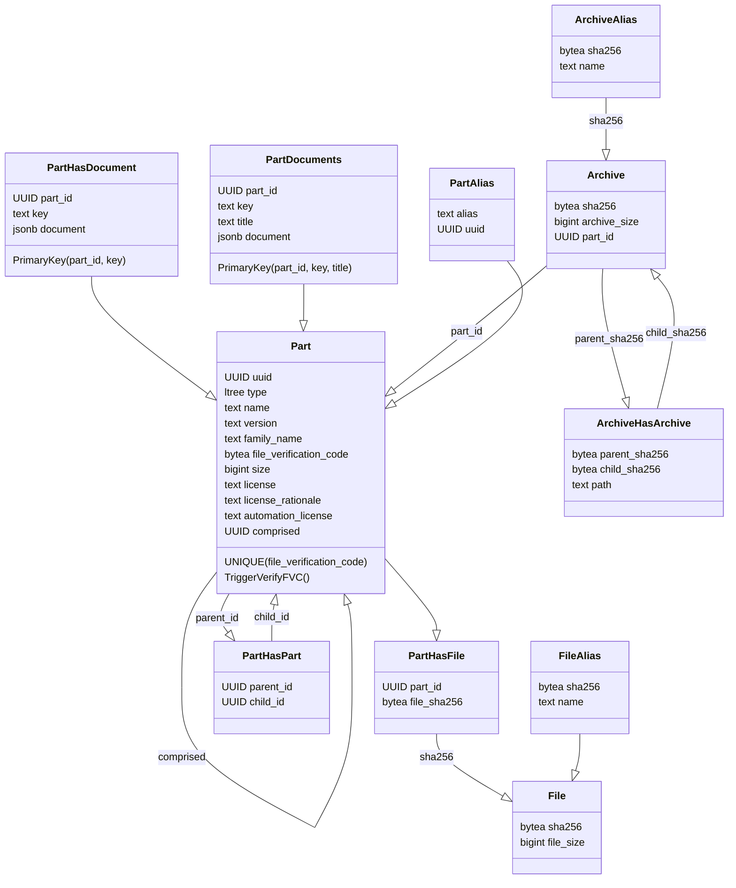

# High Level Diagram

```mermaid
classDiagram
Part --|> Part : comprised

Part : UUID uuid
Part : ltree type
Part : text name
Part : text version
Part : text family_name
Part : bytea file_verification_code
Part : bigint size
Part : text license
Part : text license_rationale
Part : text automation_license
Part : UUID comprised
Part : UNIQUE(file_verification_code)
Part : TriggerVerifyFVC()

PartHasDocument --|> Part
PartHasDocument : UUID part_id
PartHasDocument : text key
PartHasDocument : jsonb document
PartHasDocument : PrimaryKey(part_id, key)

PartDocuments --|> Part
PartDocuments : UUID part_id
PartDocuments : text key
PartDocuments : text title
PartDocuments : jsonb document
PartDocuments : PrimaryKey(part_id, key, title)

Part --|> PartHasFile
Part --|> PartHasPart : parent_id
Archive --|> ArchiveHasArchive : parent_sha256
Archive --|> Part : part_id
Archive : bytea sha256
Archive : bigint archive_size
Archive : UUID part_id
ArchiveHasArchive --|> Archive : child_sha256


PartHasPart : UUID parent_id
PartHasPart : UUID child_id
PartHasPart --|> Part : child_id
PartHasFile : UUID part_id
PartHasFile : bytea file_sha256
PartHasFile --|> File : sha256

File : bytea sha256
File : bigint file_size

ArchiveHasArchive : bytea parent_sha256
ArchiveHasArchive : bytea child_sha256
ArchiveHasArchive : text path

ArchiveAlias --|> Archive : sha256
ArchiveAlias : bytea sha256
ArchiveAlias : text name

FileAlias --|> File
FileAlias : bytea sha256
FileAlias : text name

PartAlias --|> Part
PartAlias : text alias
PartAlias : UUID uuid
```
